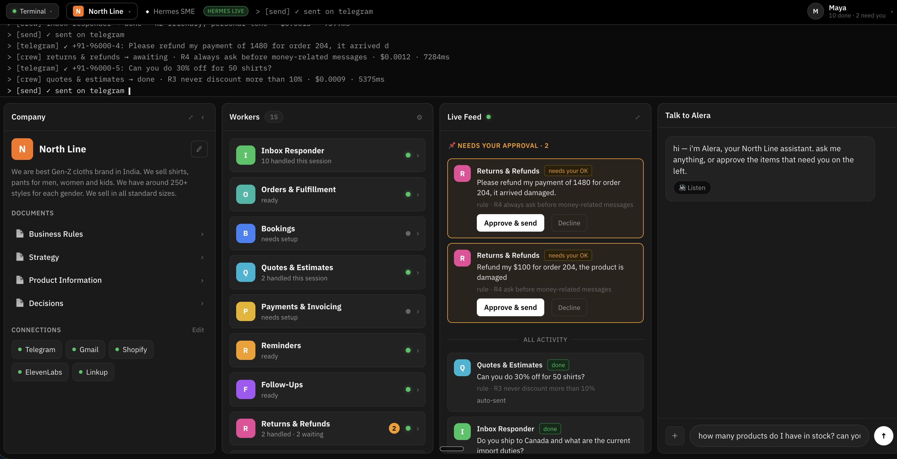
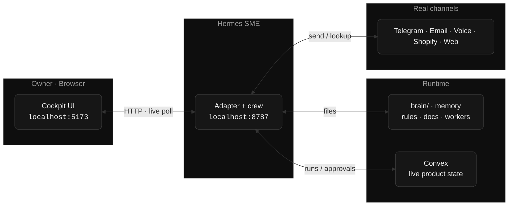

# Hermes SME

[](./LICENSE)
&nbsp;Open source · built on [Nous Research Hermes](https://github.com/NousResearch)

**A control panel that turns a [Hermes](https://github.com/NousResearch) agent into a self-directed assistant for a small business — no terminal, no config, no "agent" jargon.**

The owner opens one screen and sees their **rules**, a **live feed** of what the assistant did (or wants approval for, or declined — always with the reason), an **ask box**, and their **documents**. Under the hood a real multi-agent crew reads customer messages, checks them against the owner's rules, drafts replies, and — with a human tap — sends them on real channels (Telegram, email, voice). The assistant is named **Alera**.



---

## Table of contents

- [Why](#why)
- [How it works](#how-it-works)
- [The dashboard](#the-dashboard)
- [The agent crew](#the-agent-crew)
- [Integrations we used](#integrations-we-used)
- [Hackathon partners (available integrations)](#hackathon-partners-available-integrations)
- [Quick start](#quick-start)
- [Configuration](#configuration)
- [Onboarding](#onboarding)
- [Eval gate](#eval-gate)
- [Project layout](#project-layout)
- [Privacy](#privacy)
- [License](#license)

---

## Why

Hermes is a powerful CLI agent, but a shop owner will never touch a terminal. **Hermes SME is the missing surface** — a two-way GUI where a non-technical owner can *watch* what the agent is doing and *drive* it (chat, approvals, documents, workers) from a single dashboard, while the agent runs the business day to day.

The guardrail that makes it trustworthy: **it always asks before anything money-related.** Money messages and rule exceptions wait for a human tap — nothing irreversible happens on its own.

## How it works



- **UI** — a single-page cockpit (React + TypeScript + Vite).
- **Adapter** (`server/hermes-adapter.mjs`) — a zero-heavyweight Node bridge. The browser can't spawn a process or hold API keys, so the adapter runs the crew, talks to the Hermes CLI, serves the `brain/` folder, and calls out to real channels.
- **`brain/`** — plain Markdown the agent reads and writes (rules, strategy, product, decisions, signals, customers, traces). Editing a document here is how you "program" the assistant.
- **Convex** — the backend of record for live product state (every agent run in the Live Feed), so it survives restarts and is queryable. Optional — falls back to local SQLite when `CONVEX_URL` isn't set.

Every action is two-way and synchronous — no cron. You ask, the crew runs, you get the answer.

### Staged vs. live (credential-gated)

Every outbound action is **credential-gated**. With no credential it runs **staged** — the action is recorded and shown in the cockpit, but nothing leaves the machine. Set the credential and the *exact same code path* goes live. This keeps the demo safe by default and real when you want it.

## The dashboard

| Panel | What it shows |
|---|---|
| **Company** | Editable business profile + the core documents (Business Rules, Strategy, Product Information, Decisions). The list grows as the agent creates new docs. |
| **Workers** | The jobs the assistant runs — inbox responder, orders & fulfillment, reminders, follow-ups, reviews, product insights, and more. Click one to see what it does, what it needs, and toggle it. |
| **Live Feed** | Everything the crew did, is drafting, or is waiting on — with the rule it followed. Money items surface an **Approve & send** gate. |
| **Talk to Alera** | Chat with the agent, grounded in your business (with a "thinking" indicator + voice replies). |
| **Terminal** | A live log of the crew's activity; also accepts direct commands. |

## The agent crew

Under the hood, Hermes SME runs a small **multi-agent crew** rather than a single prompt:

- **Manager / orchestrator** (`server/orchestrator.mjs`) routes each incoming signal to the right specialist.
- **Specialists** draft replies, quotes, reminders, follow-ups, and review responses.
- **Rule keeper** checks every drafted action against the owner's rules **before** it can go out, and declines what breaks them (citing the rule).
- **Traced primitive** (`server/lib/agent.mjs`) — every agent hop goes through one `runAgent()` call that records latency, token usage, and cost, producing a fully-attributed **trace tree** (visible in the Observability view and stored in `brain/traces/` + Convex).

This is what powers the **cost + trust** story: you can see who did what, why, which rule applied, and what it cost.

## Integrations we used

All are optional and credential-gated (see [Configuration](#configuration)).

| Integration | Used for | Env var(s) | Without credential |
|---|---|---|---|
| **OpenAI** | The crew's LLM brain (drafting, judging, reasoning). Shares the same key as the local Hermes runtime. | `OPENAI_API_KEY`, `ALERA_MODEL` | Uses the key from `~/.hermes/.env` if present |
| **Telegram** | Primary live surface — a customer texts the bot and gets a real reply back (text + voice). Long-poll, no public webhook needed. | `TELEGRAM_BOT_TOKEN` | Staged (reply recorded, not sent) |
| **Resend** | Outbound email over a clean HTTPS API (no SMTP/app-password dance). Preferred email sender. | `RESEND_API_KEY`, `RESEND_FROM` | Falls back to Gmail SMTP, else staged |
| **Gmail SMTP** | Email fallback via `nodemailer` when Resend isn't set. | `GMAIL_USER`, `GMAIL_APP_PASSWORD` | Staged |
| **ElevenLabs** | Voice replies — the assistant can answer with a spoken message (e.g. a Telegram voice note). | `ELEVENLABS_API_KEY`, `ELEVENLABS_VOICE_ID` | Text-only |
| **Shopify** | Real order + stock lookup (Admin API, `read_orders` + `read_products`). | `SHOPIFY_STORE`, `SHOPIFY_ADMIN_TOKEN` | Uses the local demo catalog |
| **Linkup** | Live web search / grounding when the crew needs external info. | `LINKUP_API_KEY` | Skipped |
| **Convex** | Backend of record for live product state (agent-run feed + held drafts); survives restarts, queryable dashboard. | `CONVEX_URL` | Local SQLite fallback |
| **Cloudflare** | Hosting for the marketing/landing page (`landing/`, Wrangler). | — | — |

> Email routing: if `RESEND_API_KEY` is set it uses Resend; otherwise it tries Gmail SMTP; otherwise the send is staged. Telegram voice notes use ElevenLabs when its key is present.

## Hackathon partners (available integrations)

Built for the Hermes Agent hackathon. Partners whose tools were available to build with:

| Partner | Role | Used here? |
|---|---|---|
| **OpenAI** | AI partner (models) | ✅ crew LLM |
| **ElevenLabs** | Voice partner | ✅ voice replies |
| **Convex** | Database partner | ✅ product-state store |
| **Cloudflare** | Hosting partner | ✅ landing page |
| **Linkup** | Web search partner | ✅ grounding search |
| **Razorpay** | Ecosystem partner (payments) | Surfaced as a connector (roadmap) |
| **Wispr Flow** | Voice partner | — |
| **GrowthX** | Presented by | — |
| **Hissa Fund** | Liquidity partner | — |

## Quick start

Two terminals, from this folder:

```bash
npm install
npm run hermes    # adapter + crew → http://localhost:8787
npm run dev       # UI → http://localhost:5173
```

Point the UI at the adapter with `.env.local`:

```
VITE_HERMES_URL=http://localhost:8787
```

Without it, the UI runs in a self-contained **demo** mode (no agent or keys required) — handy for trying the interface.

> Full walkthrough: **[SETUP.md](./SETUP.md)** · Adapter API contract: **[docs/hermes-bridge-api.md](./docs/hermes-bridge-api.md)**

## Configuration

The adapter loads `server/.env` automatically (`npm run hermes`). Copy the template and fill in only what you want live:

```bash
cp server/.env.example server/.env
```

Everything is optional — unset credentials just run **staged**. See [`server/.env.example`](./server/.env.example) for the full annotated list (LLM, Telegram, Resend/Gmail, ElevenLabs, Shopify, Convex, eval gate, bridge auth).

## Onboarding

On first run the chat starts in **setup** mode. Click **✎ Edit business**, enter your business name and what you do, and **Save & remember**. The agent then:

1. stores the profile in Hermes long-term memory (remembered every session),
2. adopts the persona of *your* business's assistant (identifies as Alera for your brand), and
3. sets up the workers.

## Eval gate

`npm run eval` runs a scenario suite (`server/eval/cases.json`) against the crew and reports a pass rate. `EVAL_MIN` (default `0.8`) is the release gate — below it, the build is considered failing. Results are written to `server/eval/results/`.

## Project layout

```
alera/
├── src/                    # React UI (cockpit)
│   ├── App.tsx             # shell: top bar, terminal, side panels
│   ├── pages/Home.tsx      # the dashboard
│   ├── pages/Observability.tsx  # trace / cost view
│   ├── components/         # side panels (docs, workers, settings)
│   └── lib/hermesClient.ts # the one bridge the UI calls
├── server/
│   ├── hermes-adapter.mjs  # HTTP bridge (the API the UI talks to)
│   ├── orchestrator.mjs    # multi-agent crew (manager + specialists)
│   ├── channels.mjs        # Telegram / Resend / Gmail / delivery
│   ├── voice.mjs           # ElevenLabs TTS
│   ├── shopify.mjs         # order + stock lookup
│   ├── linkup.mjs          # web search
│   ├── catalog.mjs         # product catalog
│   ├── eval/               # scenario suite + release gate
│   └── lib/                # agent primitive, trace, db, convex store
├── convex/                 # Convex schema + functions (product state)
├── brain/                  # Markdown the agent reads/writes
├── landing/                # marketing page (Cloudflare Wrangler)
└── docs/                   # setup, bridge API, screenshots
```

## Privacy

Runtime agent output — customer messages, phone numbers, emails, and conversation traces — lives in `brain/customers/` and `brain/traces/` and is **git-ignored**; it never leaves your machine. Local runtime config (`.env`, `.env.local`, `server/state.json`, `server/business.json`) is ignored too.

## Contributing

Hermes SME is **open source** and contributions are welcome — issues, ideas, and pull requests. If you're building on the Hermes ecosystem, fork and adapt.

## License

[MIT](./LICENSE) © 2026 — free to use, modify, and distribute.

Built on [Nous Research Hermes](https://github.com/NousResearch).
